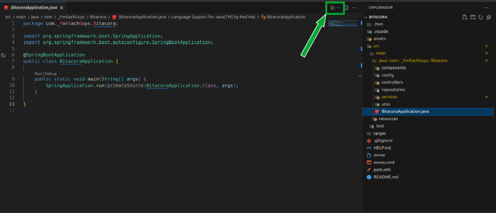
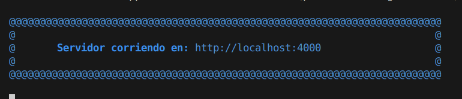

# PROYECTO BITÁCORA DE ACTIVIDADES

## 🔰 Equipo: 
* 👨 David Carreño (Líder)
* 👨 Daniel Navas
* 👧 Diana Diaz
* 👨 Sergio Garavito

## 🛠️ Tecnologías usadas:

    
    
    
    
    
    
    

---

## ✅ Estado:

|No.| 📦 Módulo | 🚩 Estado | 🚧 Pendiente |
|:-:|:---------:|:---------:|:--------------:|
|1  |Login      |En proceso |Pruebas con frontEnd|

---

## 📑 Pasos:

1. **Cree la base de datos con MySQL:**

    ~~~sql
    CREATE DATABASE IF NOT EXISTS 4ForEachGuys
        DEFAULT CHARACTER SET = 'utf8mb4';
    ~~~

1. **Registre los roles iniciales:**

    ~~~sql
    INSERT INTO roles (nombre, descripcion) VALUES 
    ("ADMINISTRADOR", "Tiene todos los permisos"),
    ("COLABORADOR", "Puede ver y asignarse actividades");
    ~~~

1. **Descargue y descomprima el .zip o clone el proyecto**

1. **Configure properties:**
    1. Ruta dentro del proyecto: **src/main/resources/application.properties**

    2. Cambie usuario y contraseña de su base de datos:
        * **spring.datasource.username=su_usuaro**
        * **spring.datasource.password=su_contraseña**
        * Haga mas cambios si asi lo requiere

1. **Inicialice el sistema:**

    * Ruta: src/main/java/com/_ForEachGuys/Bitacora/BitacoraApplication.java

    * Desde visual code:
        

    * Desde terminal:

        ~~~bash
            cd /ruta/a/tu/proyecto

            mvn package
        ~~~

        ejemplo:
        ~~~bash
            cd Descargas/BITACORA

            mvn package
        ~~~

        o si lo clonó

        ~~~bash
            cd Descargas/BITACORA

            mvn package
        ~~~

        luego
        ~~~bash
            cd target

            java -jar BITACORA-0.0.1-SNAPSHOT.jar
        ~~~

1. **URL's navegador web:**
    * http://localhost:4000

 

---
# 🔐 Licencia